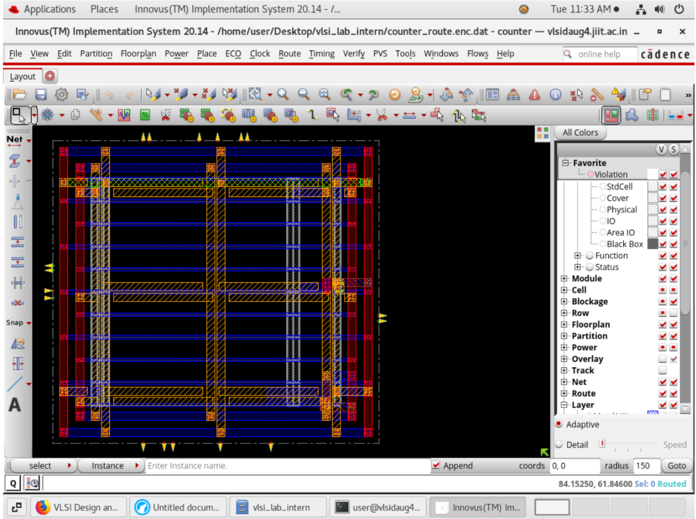

# Counter Design – RTL to GDSII

## 📌 Project Overview

This project demonstrates the complete **RTL-to-GDSII implementation** of a digital Counter using **Verilog HDL** and **Cadence Innovus**. The design flow includes synthesis, floorplanning, placement, clock tree synthesis, routing, timing analysis, area analysis, and power analysis.

---

## 🚀 Design Flow

* RTL Design using Verilog HDL
* Logic Synthesis
* Floorplanning
* Placement
* Clock Tree Synthesis (CTS)
* Routing
* Timing Analysis
* Area Analysis
* Power Analysis

---

## 🛠 Tools Used

* Verilog HDL
* Cadence Genus
* Cadence Innovus
* Cadence SimVision
* Linux Environment

---

## 📊 Results

### Timing Report

| Parameter       | Value    |
| --------------- | -------- |
| WNS             | 0.000 ns |
| TNS             | 0.000 ns |
| Violating Paths | 0        |

### Area Report

| Parameter       | Value    |
| --------------- | -------- |
| Total Instances | 57       |
| Total Area      | 2270.660 |

### Power Report

| Parameter       | Value         |
| --------------- | ------------- |
| Total Power     | 0.004067 mW   |
| Internal Power  | 0.00336494 mW |
| Switching Power | 0.00068916 mW |
| Leakage Power   | 0.00001290 mW |

---

## 📷 Simulation Waveform

The following waveform shows the functional verification of the Counter design using Cadence SimVision.

  

### Signals

* `clk` → Clock signal
* `rst` → Reset signal
* `count` → Counter output

### Verification

* Functional simulation completed successfully
* Counter increments correctly on every clock edge
* Verified using Cadence SimVision

---

## 📷 Physical Design Layout

  

### Backend Flow Completed

* Placement
* CTS
* Routing
* Timing Closure
* Power Analysis

---

---

## 🎯 Learning Outcomes

* Understanding complete RTL-to-GDSII flow
* Timing closure and routing optimization
* Power and area analysis
* Physical verification concepts
* Practical exposure to Cadence backend tools

---

## 👨‍💻 Author

**Priyanshu Garg**
Electronics & Communication Engineering
JIIT Noida

📧 [gargpriyanshu0453@gmail.com](mailto:gargpriyanshu0453@gmail.com)

🔗 LinkedIn:
https://www.linkedin.com/in/priyanshu-g-899424271/

🔗 GitHub:
https://github.com/priyanshugarg1234
